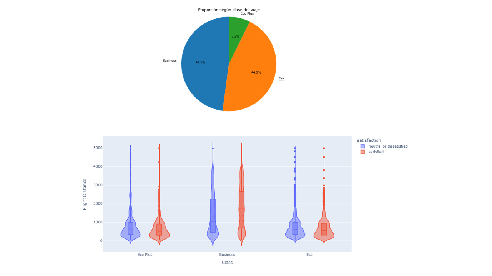
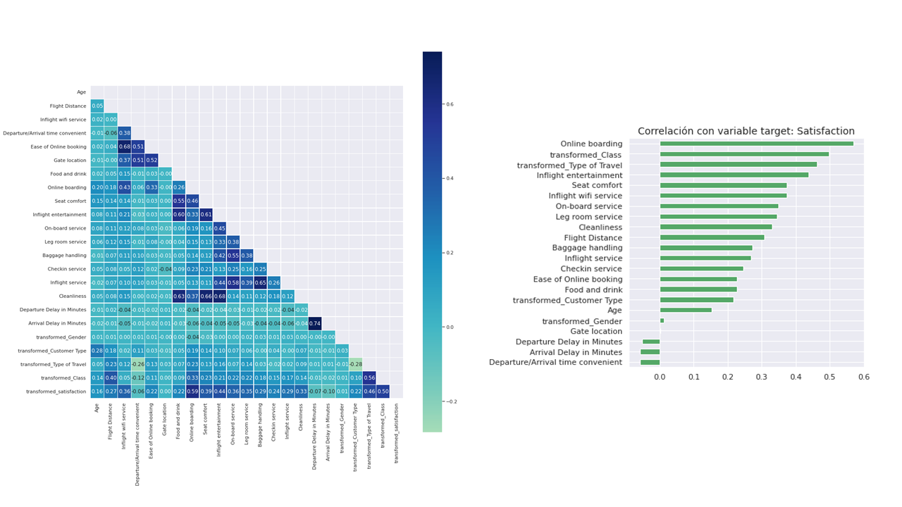
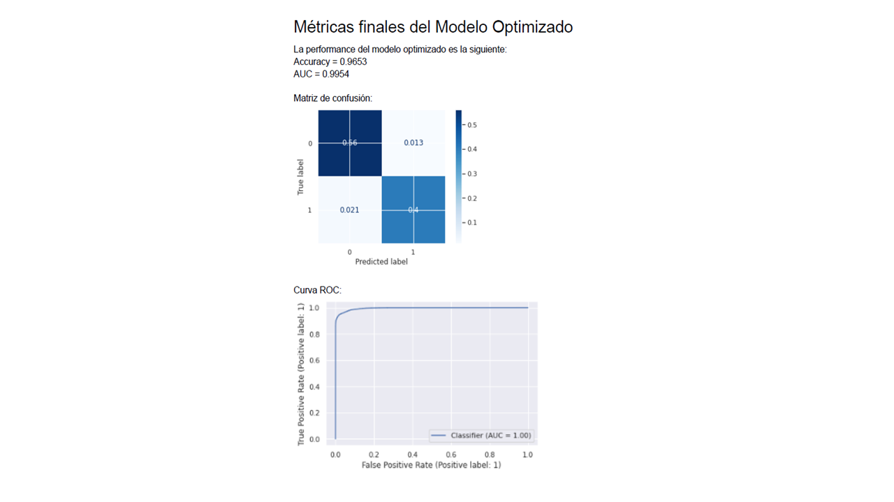

# Proyecto final del curso Data Science de Coderhouse

El **objetivo general** del presente trabajo es predecir a través de un modelo de Machine Learning la satisfacción de los pasajeros con la mayor asertividad posible, según ciertos contextos y analizar qué variables impactan con mayor correlación en la satisfacción.

Se plantean como **objetivos específicos**: 
* Conocer las características y preferencias de los clientes de acuerdo al género, edad, tipo de cliente y clase de vuelo que utilizan. 
* Identificar cuáles son los servicios que deben mejorarse, y ver si se asocian a las características generales de los clientes. 
* Analizar las características generales de los vuelos que tienen mayores inconvenientes (Por ejemplo: demoras en partida/arribo), y ver si la información recolectada es de utilidad para proponer soluciones a los mismos. 
* Desarrollar un modelo predictivo que permita identificar el nivel de satisfacción de los pasajeros respecto a los servicios brindados.

